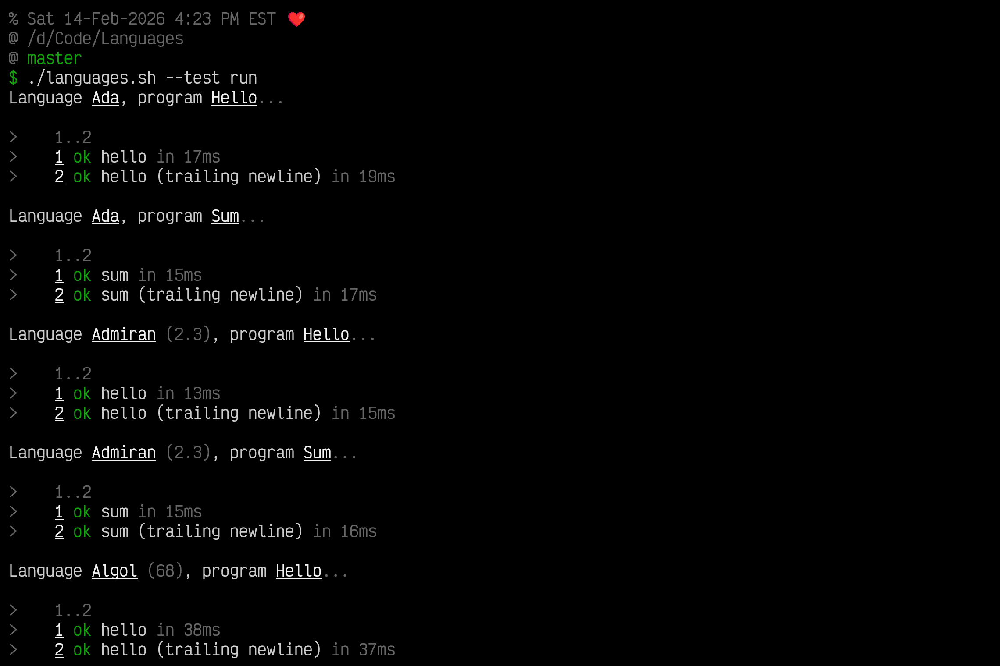

## Summary

This repository contains examples of 100+ programming languages.

Besides just showing example programs, the programs are runnable in a reproducible manner via Dockerfiles. Additionally, the programs are tested to ensure they indeed produce the expected output(s).

## Screenshot



## Contents

- [Summary](#summary)
- [Screenshot](#screenshot)
- [Contents](#contents)
- [Technical background](#technical-background)
- [Help](#help)
- [Usage examples](#usage-examples)
- [Programs](#programs)
	- [`hello`](#hello)
	- [`sum`](#sum)
	- [`microwave`](#microwave)
	- [`freestyle`](#freestyle)
- [Checklist](#checklist)
- [Cheating](#cheating)

## Technical background

Podman is used to build and execute a multi-layer image.

| Layer | Name       | Description                                                   |
| ----- | ---------- | ------------------------------------------------------------- |
| 1     | `base`     | Debian 13 (Trixie), common apt packages.                      |
| 2     | `system`   | Things shared between all languages (entry point, tests...).  |
| 3     | `language` | Things shared within a language (language-specific setup...). |
| 4     | `program`  | The specific program for the language.                        |

This provides the following (for example):

* Changing a unit test (`system` layer) does not require re-installing apt packages (`base` layer).
* Changing a language setup script (`language` layer) does not require rebuilding the `base` or `system` layers.
* Changing a program does not require rebuilding any other layer (`base`, `system`, or `language`).

## Help

```
$ ./languages.sh --help
languages.sh 0.0.0.0

Usage:
  languages.sh [options] <command>

Options:
  --configure         Install needed dependencies, etc.
  --debug             Debug everything.
  --debug-container   Debug container building, etc.
  --debug-program     Debug program execution.
  --debug-setup       Debug language setup script.
  --help              Show this help message.
  --interactive       Begin an interaction session.
  --parallel          Runs multiple programs concurrently.
  --prime             Pre-generates image(s) without running them.
  --reverse           Runs programs in reverse order.
  --test              Run unit tests.
  --version           Show version information.

Commands:
  clean                      Remove stored images and containers.
  list                       List languages and their programs.
  run                        Run all languages and programs.
  run <LANGUAGE>             Run all programs for a language.
  run <LANGUAGE> <PROGRAM>   Run a specific language's program.
```

## Usage examples

* List available languages and programs:
  * `./languages.sh list`
* Run everything:
  * `./languages.sh run`
* Run all C# programs:
  * `./languages.sh run csharp`
* Run the C# _hello_ program:
  * `./languages.sh run csharp hello`
* Debug the C# _hello_ program:
  * `./languages.sh --debug run csharp hello`
* Enter interactive mode for C#, with the _hello_ program loaded:
  * `./languages.sh --interactive csharp hello`
* Run tests for Rust (all programs):
  * `./languages.sh --test run rust`
* Help/usage:
  * `./languages.sh --help`
* Version:
  * `./languages.sh --version`

## Programs

### `hello`

This program should print `Hello, world!`, with a trailing newline, and exit with status `0`.

This program may seem pointless, however it serves as a useful first exercise in ensuring the language's toolchain is installed and working correctly.

### `sum`

This program should print the sum of 0-100 (inclusive), which is `5050`, with a trailing newline, and exit with status `0`.

### `microwave`

This program converts a string, as may be typed into a simple microwave, into `MM:SS` format, with a trailing newline.

The input must be passed as a single positional argument to the program. Any other usage is an error.

A usage error should exit with status `1`. An invalid argument should exit with status `2`.

Correct behavior is based on the _Whirlpool WMH31017HZ-2_ (my kitchen microwave). This is a common kitchen microwave that is customarily installed above a range/stove. I have observed that other microwaves have varying behavior for strange inputs, such as `161` or `9999`. I chose this microwave as my source of truth merely because I have easy access to it.

Do not run a microwave without something in it to absorb the magnetron's radiation, or your microwave may damage itself. I used a large bowl of water to test behavior for inputs such as `9999`.

**Valid input examples**

|                  |                 |                  |                  |
| ---------------: | --------------: | ---------------: | ---------------: |
| `0000` → `00:00` |  `60` → `01:00` |  `960` → `10:00` | `9959` → `99:59` |
|  `000` → `00:00` |  `61` → `01:01` |  `961` → `10:01` | `9960` → `99:60` |
|   `00` → `00:00` |  `90` → `01:30` |  `999` → `10:39` | `9961` → `99:61` |
|    `0` → `00:00` |  `99` → `01:39` | `1000` → `10:00` | `9999` → `99:99` |
|    `1` → `00:01` | `100` → `01:00` | `1001` → `10:01` |                  |
|   `59` → `00:59` | `101` → `01:01` |                  |                  |
|                  | `159` → `01:59` |                  |                  |
|                  | `160` → `02:00` |                  |                  |
|                  | `161` → `02:01` |                  |                  |
|                  | `199` → `02:39` |                  |                  |
|                  | `200` → `02:00` |                  |                  |
|                  | `201` → `02:01` |                  |                  |
|                  | `959` → `09:59` |                  |                  |

**Invalid input examples**

* _Empty string_
* `x`
* `xxxx`
* `-1`
* `12345`

### `freestyle`

These programs are intended to demonstrate unique or interesting language features.

Test requirements are loose:

* There must be standard output (stdout).
* There must not be error output (stderr).
* Exit status must be 0.

## Checklist

| Language                                                       | `hello` | `sum` | `microwave` | `freestyle` |
| -------------------------------------------------------------- | :-----: | :---: | :---------: | :---------: |
| [📂](src/ada) Ada                                               |    ✅    |   ✅   |      ⬜      |      ⬜      |
| [📂](src/admiran) Admiran                                       |    ✅    |   ✅   |      ⬜      |      ⬜      |
| [📂](src/agda) Agda                                             |    ✅    |   ✅   |      ⬜      |      ⬜      |
| [📂](src/algol.60) Algol (60)¹                                  |    ✅️    |   ✅️   |      ⬜      |      ⬜      |
| [📂](src/algol.68) Algol (68)                                   |    ✅️    |   ✅   |      ⬜      |      ⬜      |
| [📂](src/alumina) Alumina                                       |    ✅️    |   ✅️   |      ⬜      |      ⬜      |
| [📂](src/apl) APL                                               |    ✅️    |   ✅️   |      ⬜      |      ⬜      |
| [📂](src/arturo) Arturo                                         |    ✅    |   ✅   |      ⬜      |      ⬜      |
| [📂](src/assembly.gnu) Assembly (GNU)                           |    ✅    |   ✅   |      ⬜      |      ⬜      |
| [📂](src/assembly.microsoft) Assembly (Microsoft)               |    ✅    |   ✅   |      ⬜      |      ⬜      |
| [📂](src/assembly.netwide) Assembly (Netwide)                   |    ✅    |   ✅   |      ⬜      |      ⬜      |
| [📂](src/atlas) Atlas Autocode                                  |    ⬜    |   ⬜   |      ⬜      |      ⬜      |
| [📂](src/ats) ATS                                               |    ⬜    |   ⬜   |      ⬜      |      ⬜      |
| [📂](src/austral) Austral                                       |    ✅    |   ✅   |      ⬜      |      ⬜      |
| [📂](src/awk) Awk                                               |    ✅    |   ✅   |      ⬜      |      ⬜      |
| [📂](src/axum) Axum                                             |    ⬜    |   ⬜   |      ⬜      |      ⬜      |
| [📂](src/b) [B](src/b/README.md)                                |    ✅    |   ✅   |      ⬜      |      ⬜      |
| [📂](src/b4x) B4X                                               |    ⬜    |   ⬜   |      ⬜      |      ⬜      |
| [📂](src/ballerina) Ballerina                                   |    ✅    |   ✅   |      ⬜      |      ⬜      |
| [📂](src/bash) Bash                                             |    ✅    |   ✅   |      ✅      |      ✅      |
| [📂](src/basic) BASIC (QuickBASIC)¹                             |    ✅    |   ✅   |      ⬜      |      ⬜      |
| [📂](src/batch) Batch                                           |    ✅    |   ✅   |      ⬜      |      ⬜      |
| [📂](src/bcpl) BCPL                                             |    ✅    |   ✅   |      ⬜      |      ⬜      |
| [📂](src/beanshell) Beanshell                                   |    ✅    |   ✅   |      ⬜      |      ⬜      |
| [📂](src/beef) Beef                                             |    ✅    |   ✅   |      ⬜      |      ⬜      |
| [📂](src/brainf_ck) Brainf#ck                                   |    ✅    |   ⬜   |      ⬜      |      ⬜      |
| [📂](src/c) C                                                   |    ✅    |   ✅   |      ✅      |      ⬜      |
| [📂](src/csharp) C#                                             |    ✅    |   ✅   |      ✅      |      ⬜      |
| [📂](src/cmm) C--                                               |    ⬜    |   ⬜   |      ⬜      |      ⬜      |
| [📂](src/cpp) C++                                               |    ✅    |   ✅   |      ✅      |      ⬜      |
| [📂](src/c2) C2                                                 |    ✅    |   ✅   |      ⬜      |      ⬜      |
| [📂](src/c3) C3                                                 |    ✅    |   ✅   |      ⬜      |      ⬜      |
| [📂](src/cakelisp) Cakelisp                                     |    ⬜    |   ⬜   |      ⬜      |      ⬜      |
| [📂](src/caml) Caml                                             |    ✅    |   ✅   |      ⬜      |      ⬜      |
| [📂](src/carbon) Carbon                                         |    ✅    |   ✅   |      ⬜      |      ⬜      |
| [📂](src/carp) Carp                                             |    ⬜    |   ⬜   |      ⬜      |      ⬜      |
| [📂](src/ceylon) Ceylon                                         |    ⬜    |   ⬜   |      ⬜      |      ⬜      |
| [📂](src/chapel) Chapel                                         |    ✅    |   ✅   |      ✅      |      ⬜      |
| [📂](src/chuck) ChucK                                           |    ✅    |   ✅   |      ⬜      |      ✅      |
| [📂](src/clean) Clean                                           |    ⬜    |   ⬜   |      ⬜      |      ⬜      |
| [📂](src/clojure) Clojure                                       |    ✅    |   ✅   |      ⬜      |      ⬜      |
| [📂](src/clu) CLU                                               |    ✅    |   ✅   |      ⬜      |      ⬜      |
| [📂](src/cms-2) CMS-2                                           |    ⬜    |   ⬜   |      ⬜      |      ⬜      |
| [📂](src/cobol) COBOL                                           |    ✅    |   ✅   |      ⬜      |      ⬜      |
| [📂](src/cobra) Cobra                                           |    ✅    |   ✅   |      ⬜      |      ⬜      |
| [📂](src/coffeescript) CoffeeScript                             |    ✅    |   ✅   |      ⬜      |      ⬜      |
| [📂](src/coldfusion) ColdFusion                                 |    ✅    |   ✅   |      ⬜      |      ⬜      |
| [📂](src/concrete) Concrete                                     |    ⬜    |   ⬜   |      ⬜      |      ⬜      |
| [📂](src/cone) Cone                                             |    ⬜    |   ⬜   |      ⬜      |      ⬜      |
| [📂](src/control) Control Language                              |    ⬜    |   ⬜   |      ⬜      |      ⬜      |
| [📂](src/cowgol) Cowgol                                         |    ✅    |   ✅   |      ⬜      |      ⬜      |
| [📂](src/cpl) CPL                                               |    ⬜    |   ⬜   |      ⬜      |      ⬜      |
| [📂](src/crystal) Crystal                                       |    ✅    |   ✅   |      ⬜      |      ⬜      |
| [📂](src/csound) Csound                                         |    ✅    |   ✅   |      ⬜      |      ✅      |
| [📂](src/css) [CSS](src/css/README.md)¹                         |    ✅    |   ✅   |      ⚠️      |      ⬜      |
| [📂](src/cwerg) Cwerg                                           |    ✅    |   ✅   |      ✅      |      ⬜      |
| [📂](src/cyclone) Cyclone                                       |    ⬜    |   ⬜   |      ⬜      |      ⬜      |
| [📂](src/d) D                                                   |    ✅    |   ✅   |      ✅      |      ⬜      |
| [📂](src/dafny) Dafny                                           |    ⬜    |   ⬜   |      ⬜      |      ⬜      |
| [📂](src/dart) Dart                                             |    ✅    |   ✅   |      ⬜      |      ⬜      |
| [📂](src/daslang) Daslang                                       |    ✅    |   ✅   |      ⬜      |      ⬜      |
| [📂](src/dbase) dBase                                           |    ⬜    |   ⬜   |      ⬜      |      ⬜      |
| [📂](src/delphi) Delphi                                         |    ✅    |   ✅   |      ⬜      |      ⬜      |
| [📂](src/duck) Duck                                             |    ⬜    |   ⬜   |      ⬜      |      ⬜      |
| [📂](src/e) E                                                   |    ✅    |   ✅   |      ⬜      |      ⬜      |
| [📂](src/ec) eC                                                 |    ⬜    |   ⬜   |      ⬜      |      ⬜      |
| [📂](src/edinburgh-imp) Edinburgh IMP                           |    ⬜    |   ⬜   |      ⬜      |      ⬜      |
| [📂](src/effekt) Effekt                                         |    ⬜    |   ⬜   |      ⬜      |      ⬜      |
| [📂](src/eiffel) Eiffel                                         |    ✅    |   ✅   |      ⬜      |      ⬜      |
| [📂](src/elixir) Elixir                                         |    ✅    |   ✅   |      ⬜      |      ⬜      |
| [📂](src/elk.a) [Elk](src/elk.a/README.md) (A)                  |    ✅    |   ✅   |      ⬜      |      ⬜      |
| [📂](src/elk.b) [Elk](src/elk.b/README.md) (B)                  |    ✅    |   ✅   |      ⬜      |      ⬜      |
| [📂](src/elm) Elm                                               |    ✅    |   ✅   |      ⬜      |      ⬜      |
| [📂](src/emacs-lisp) Emacs Lisp                                 |    ✅    |   ✅   |      ⬜      |      ⬜      |
| [📂](src/erlang) Erlang                                         |    ✅    |   ✅   |      ⬜      |      ⬜      |
| [📂](src/euclid) Euclid                                         |    ⬜    |   ⬜   |      ⬜      |      ⬜      |
| [📂](src/extempore) Extempore                                   |    ⬜    |   ⬜   |      ⬜      |      ⬜      |
| [📂](src/fstar) F*                                              |    ⬜    |   ⬜   |      ⬜      |      ⬜      |
| [📂](src/fsharp) F#                                             |    ✅    |   ✅   |      ⬜      |      ⬜      |
| [📂](src/factor) Factor                                         |    ✅    |   ✅   |      ⬜      |      ⬜      |
| [📂](src/fifth) Fifth                                           |    ✅    |   ✅   |      ⬜      |      ⬜      |
| [📂](src/fl) FL                                                 |    ⬜    |   ⬜   |      ⬜      |      ⬜      |
| [📂](src/flix) Flix                                             |    ⬜    |   ⬜   |      ⬜      |      ⬜      |
| [📂](src/flow-matic) FLOW-MATIC                                 |    ⬜    |   ⬜   |      ⬜      |      ⬜      |
| [📂](src/flux) Flux                                             |    ⬜    |   ⬜   |      ⬜      |      ⬜      |
| [📂](src/forth) Forth                                           |    ✅    |   ✅   |      ⬜      |      ⬜      |
| [📂](src/fortran) Fortran                                       |    ✅    |   ✅   |      ⬜      |      ⬜      |
| [📂](src/foxpro) FoxPro                                         |    ⬜    |   ⬜   |      ⬜      |      ⬜      |
| [📂](src/fp) FP                                                 |    ⬜    |   ⬜   |      ⬜      |      ⬜      |
| [📂](src/futhark) [Futhark](src/futhark/README.md)              |    ⚠️    |   ✅   |      ⬜      |      ⬜      |
| [📂](src/g-portugol) G-Portugol                                 |    ✅    |   ✅   |      ⬜      |      ⬜      |
| [📂](src/gambas) Gambas                                         |    ⬜    |   ⬜   |      ⬜      |      ⬜      |
| [📂](src/gams) GAMS                                             |    ⬜    |   ⬜   |      ⬜      |      ⬜      |
| [📂](src/gap) GAP                                               |    ⬜    |   ⬜   |      ⬜      |      ⬜      |
| [📂](src/gdscript) GDScript                                     |    ⬜    |   ⬜   |      ⬜      |      ⬜      |
| [📂](src/gleam) Gleam                                           |    ✅️    |   ✅️   |      ⬜      |      ⬜      |
| [📂](src/glim) Glim                                             |    ⬜    |   ⬜   |      ⬜      |      ⬜      |
| [📂](src/go) Go                                                 |    ✅️    |   ✅   |      ⬜      |      ⬜      |
| [📂](src/groovy) Groovy                                         |    ✅️    |   ✅   |      ⬜      |      ⬜      |
| [📂](src/gurgle) Gurgle                                         |    ⬜    |   ⬜   |      ⬜      |      ⬜      |
| [📂](src/hack) Hack                                             |    ✅    |   ✅   |      ⬜      |      ⬜      |
| [📂](src/hal-s) HAL/S                                           |    ⬜    |   ⬜   |      ⬜      |      ⬜      |
| [📂](src/hare) Hare                                             |    ✅    |   ✅   |      ⬜      |      ⬜      |
| [📂](src/haskell) Haskell                                       |    ✅    |   ✅   |      ⬜      |      ⬜      |
| [📂](src/haxe) Haxe                                             |    ✅    |   ✅   |      ⬜      |      ⬜      |
| [📂](src/holyc) HolyC                                           |    ✅    |   ✅   |      ✅      |      ⬜      |
| [📂](src/hope) Hope                                             |    ⬜    |   ⬜   |      ⬜      |      ⬜      |
| [📂](src/hopper) Hopper                                         |    ⬜    |   ⬜   |      ⬜      |      ⬜      |
| [📂](src/html) [HTML](src/html/README.md)¹                      |    ✅    |   ⚠️   |      ⚠️      |      ⬜      |
| [📂](src/hylo) Hylo                                             |    ⬜    |   ⬜   |      ⬜      |      ⬜      |
| [📂](src/hypertalk) HyperTalk                                   |    ⬜    |   ⬜   |      ⬜      |      ⬜      |
| [📂](src/icon) Icon                                             |    ✅    |   ✅   |      ⬜      |      ⬜      |
| [📂](src/idris) Idris                                           |    ⬜    |   ⬜   |      ⬜      |      ⬜      |
| [📂](src/inform) Inform                                         |    ✅    |   ✅   |      ⬜      |      ⬜      |
| [📂](src/ink) Ink                                               |    ✅    |   ✅   |      ⬜      |      ⬜      |
| [📂](src/inko) Inko                                             |    ⬜    |   ⬜   |      ⬜      |      ⬜      |
| [📂](src/io) Io                                                 |    ✅    |   ✅   |      ⬜      |      ⬜      |
| [📂](src/isabelle) Isabelle¹                                    |    ✅    |   ✅   |      ⬜      |      ⬜      |
| [📂](src/j) J                                                   |    ⬜    |   ⬜   |      ⬜      |      ⬜      |
| [📂](src/jsharp) J#                                             |    ⬜    |   ⬜   |      ⬜      |      ⬜      |
| [📂](src/jai) Jai                                               |    ⬜    |   ⬜   |      ⬜      |      ⬜      |
| [📂](src/jank) Jank                                             |    ⬜    |   ⬜   |      ⬜      |      ⬜      |
| [📂](src/java) Java                                             |    ✅    |   ✅   |      ✅      |      ⬜      |
| [📂](src/javascript) JavaScript                                 |    ✅    |   ✅   |      ✅      |      ⬜      |
| [📂](src/joule) Joule                                           |    ⬜    |   ⬜   |      ⬜      |      ⬜      |
| [📂](src/jovial) JOVIAL                                         |    ✅    |   ✅   |      ⬜      |      ⬜      |
| [📂](src/joy) [Joy](src/joy/README.md)¹                         |    ✅    |   ✅   |      ⬜      |      ⬜      |
| [📂](src/jspp) JS++                                             |    ⬜    |   ⬜   |      ⬜      |      ⬜      |
| [📂](src/jscript) JScript                                       |    ⬜    |   ⬜   |      ⬜      |      ⬜      |
| [📂](src/jtw) Jtw                                               |    ⬜    |   ⬜   |      ⬜      |      ⬜      |
| [📂](src/jule) Jule                                             |    ⬜    |   ⬜   |      ⬜      |      ⬜      |
| [📂](src/julia) Julia                                           |    ✅    |   ✅   |      ⬜      |      ⬜      |
| [📂](src/kairo) Kairo                                           |    ⬜    |   ⬜   |      ⬜      |      ⬜      |
| [📂](src/kip) Kip                                               |    ⬜    |   ⬜   |      ⬜      |      ⬜      |
| [📂](src/kit) Kit                                               |    ⬜    |   ⬜   |      ⬜      |      ⬜      |
| [📂](src/koka) Koka                                             |    ⬜    |   ⬜   |      ⬜      |      ⬜      |
| [📂](src/kotlin) Kotlin                                         |    ✅    |   ✅   |      ⬜      |      ⬜      |
| [📂](src/krc) KRC                                               |    ⬜    |   ⬜   |      ⬜      |      ⬜      |
| [📂](src/labview) LabVIEW                                       |    ⬜    |   ⬜   |      ⬜      |      ⬜      |
| [📂](src/ladder-logic) Ladder Logic                             |    ⬜    |   ⬜   |      ⬜      |      ⬜      |
| [📂](src/lean) Lean                                             |    ⬜    |   ⬜   |      ⬜      |      ⬜      |
| [📂](src/less) Less¹                                            |    ✅    |   ✅   |      ⬜      |      ⬜      |
| [📂](src/lily.a) [Lily](src/lily.a/README.md) (A)               |    ✅    |   ✅   |      ⬜      |      ⬜      |
| [📂](src/lily.b) [Lily](src/lily.b/README.md) (B)               |    ✅    |   ✅   |      ⬜      |      ⬜      |
| [📂](src/lisp) Lisp                                             |    ✅    |   ✅   |      ⬜      |      ⬜      |
| [📂](src/litac) LitaC                                           |    ⬜    |   ⬜   |      ⬜      |      ⬜      |
| [📂](src/lobster) Lobster                                       |    ✅    |   ✅   |      ⬜      |      ⬜      |
| [📂](src/logo) Logo                                             |    ✅    |   ✅   |      ⬜      |      ⬜      |
| [📂](src/lolcode) LOLCODE                                       |    ✅    |   ✅   |      ⬜      |      ⬜      |
| [📂](src/lua) Lua                                               |    ✅    |   ✅   |      ⬜      |      ⬜      |
| [📂](src/lucia) Lucia                                           |    ⬜    |   ⬜   |      ⬜      |      ⬜      |
| [📂](src/lucid) Lucid                                           |    ⬜    |   ⬜   |      ⬜      |      ⬜      |
| [📂](src/maple) Maple                                           |    ⬜    |   ⬜   |      ⬜      |      ⬜      |
| [📂](src/matlab) MATLAB                                         |    ✅    |   ✅   |      ⬜      |      ⬜      |
| [📂](src/maxima) Maxima                                         |    ⬜    |   ⬜   |      ⬜      |      ⬜      |
| [📂](src/mesa) Mesa                                             |    ⬜    |   ⬜   |      ⬜      |      ⬜      |
| [📂](src/metaocaml) MetaOCaml                                   |    ⬜    |   ⬜   |      ⬜      |      ⬜      |
| [📂](src/miranda) Miranda                                       |    ⬜    |   ⬜   |      ⬜      |      ⬜      |
| [📂](src/modelica) Modelica                                     |    ⬜    |   ⬜   |      ⬜      |      ⬜      |
| [📂](src/modula) Modula                                         |    ⬜    |   ⬜   |      ⬜      |      ⬜      |
| [📂](src/modula-2) Modula-2                                     |    ✅    |   ✅   |      ⬜      |      ⬜      |
| [📂](src/modula-3) Modula-3                                     |    ⬜    |   ⬜   |      ⬜      |      ⬜      |
| [📂](src/mojo) Mojo                                             |    ✅    |   ✅   |      ⬜      |      ⬜      |
| [📂](src/move) Move                                             |    ⬜    |   ⬜   |      ⬜      |      ⬜      |
| [📂](src/myrddin) Myrddin                                       |    ⬜    |   ⬜   |      ⬜      |      ⬜      |
| [📂](src/napier88) Napier88                                     |    ⬜    |   ⬜   |      ⬜      |      ⬜      |
| [📂](src/natural) NATURAL                                       |    ⬜    |   ⬜   |      ⬜      |      ⬜      |
| [📂](src/nature) Nature                                         |    ⬜    |   ⬜   |      ⬜      |      ⬜      |
| [📂](src/neat) Neat                                             |    ⬜    |   ⬜   |      ⬜      |      ⬜      |
| [📂](src/nelua) Nelua                                           |    ⬜    |   ⬜   |      ⬜      |      ⬜      |
| [📂](src/nemerle) Nemerle                                       |    ✅    |   ✅   |      ⬜      |      ⬜      |
| [📂](src/never) Never                                           |    ✅    |   ✅   |      ⬜      |      ⬜      |
| [📂](src/newspeak) Newspeak                                     |    ⬜    |   ⬜   |      ⬜      |      ⬜      |
| [📂](src/nial) Nial                                             |    ✅    |   ✅   |      ⬜      |      ⬜      |
| [📂](src/nim) Nim                                               |    ✅    |   ✅   |      ✅      |      ⬜      |
| [📂](src/nit) Nit                                               |    ⬜    |   ⬜   |      ⬜      |      ⬜      |
| [📂](src/niva) Niva                                             |    ⬜    |   ⬜   |      ⬜      |      ⬜      |
| [📂](src/nix) Nix                                               |    ✅    |   ✅   |      ⬜      |      ⬜      |
| [📂](src/npl) NPL                                               |    ⬜    |   ⬜   |      ⬜      |      ⬜      |
| [📂](src/nsk) NSK                                               |    ⬜    |   ⬜   |      ⬜      |      ⬜      |
| [📂](src/nxt-g) NXT-G                                           |    ⬜    |   ⬜   |      ⬜      |      ⬜      |
| [📂](src/oak) Oak                                               |    ✅    |   ✅   |      ⬜      |      ⬜      |
| [📂](src/oberon) Oberon                                         |    ✅    |   ✅   |      ⬜      |      ⬜      |
| [📂](src/object-pascal) Object Pascal                           |    ✅    |   ✅   |      ⬜      |      ⬜      |
| [📂](src/objective-c) Objective-C                               |    ✅    |   ✅   |      ⬜      |      ⬜      |
| [📂](src/obliq) Obliq                                           |    ⬜    |   ⬜   |      ⬜      |      ⬜      |
| [📂](src/ocaml) OCaml                                           |    ✅    |   ✅   |      ⬜      |      ⬜      |
| [📂](src/ocen) Ocen                                             |    ⬜    |   ⬜   |      ⬜      |      ⬜      |
| [📂](src/odin) Odin                                             |    ⬜    |   ⬜   |      ⬜      |      ⬜      |
| [📂](src/opa) Opa                                               |    ⬜    |   ⬜   |      ⬜      |      ⬜      |
| [📂](src/opencl) OpenCL                                         |    ⬜    |   ⬜   |      ⬜      |      ⬜      |
| [📂](src/orwell) Orwell                                         |    ⬜    |   ⬜   |      ⬜      |      ⬜      |
| [📂](src/oxygene) Oxygene                                       |    ⬜    |   ⬜   |      ⬜      |      ⬜      |
| [📂](src/par) Par                                               |    ✅    |   ✅   |      ⬜      |      ⬜      |
| [📂](src/parasail) ParaSail                                     |    ⬜    |   ⬜   |      ⬜      |      ⬜      |
| [📂](src/pascal) Pascal                                         |    ✅    |   ✅   |      ⬜      |      ⬜      |
| [📂](src/perl) Perl                                             |    ✅    |   ✅   |      ⬜      |      ⬜      |
| [📂](src/phix) Phix                                             |    ⬜    |   ⬜   |      ⬜      |      ⬜      |
| [📂](src/phl) PHL                                               |    ⬜    |   ⬜   |      ⬜      |      ⬜      |
| [📂](src/php) PHP                                               |    ✅    |   ✅   |      ⬜      |      ⬜      |
| [📂](src/pike) Pike                                             |    ⬜    |   ⬜   |      ⬜      |      ⬜      |
| [📂](src/pl-6) PL-6                                             |    ⬜    |   ⬜   |      ⬜      |      ⬜      |
| [📂](src/pl-8) PL.8                                             |    ⬜    |   ⬜   |      ⬜      |      ⬜      |
| [📂](src/pl-b) PL/B                                             |    ⬜    |   ⬜   |      ⬜      |      ⬜      |
| [📂](src/pl-c) PL/C                                             |    ⬜    |   ⬜   |      ⬜      |      ⬜      |
| [📂](src/pl-i) PL/I                                             |    ⬜    |   ⬜   |      ⬜      |      ⬜      |
| [📂](src/pl-m) PL/M¹                                            |    ✅    |   ✅   |      ⬜      |      ⬜      |
| [📂](src/pl-s) PL/S                                             |    ⬜    |   ⬜   |      ⬜      |      ⬜      |
| [📂](src/pl-sql) PL/SQL                                         |    ⬜    |   ⬜   |      ⬜      |      ⬜      |
| [📂](src/plankalkul) [Plankalkül](src/plankalkul/README.md)¹    |    ✅    |   ✅   |      ⬜      |      ⬜      |
| [📂](src/planner) Planner                                       |    ⬜    |   ⬜   |      ⬜      |      ⬜      |
| [📂](src/pony) Pony                                             |    ✅    |   ✅   |      ⬜      |      ⬜      |
| [📂](src/pop-11) POP-11                                         |    ⬜    |   ⬜   |      ⬜      |      ⬜      |
| [📂](src/postscript) PostScript                                 |    ✅    |   ✅   |      ⬜      |      ⬜      |
| [📂](src/power-fx) Power Fx                                     |    ⬜    |   ⬜   |      ⬜      |      ⬜      |
| [📂](src/powershell) PowerShell                                 |    ✅    |   ✅   |      ⬜      |      ⬜      |
| [📂](src/project-verona) Project Verona                         |    ⬜    |   ⬜   |      ⬜      |      ⬜      |
| [📂](src/prolog) Prolog                                         |    ✅    |   ✅   |      ⬜      |      ⬜      |
| [📂](src/ps-algol) PS-algol                                     |    ⬜    |   ⬜   |      ⬜      |      ⬜      |
| [📂](src/pure) Pure                                             |    ⬜    |   ⬜   |      ⬜      |      ⬜      |
| [📂](src/python) Python                                         |    ✅    |   ✅   |      ⬜      |      ⬜      |
| [📂](src/q) Q                                                   |    ⬜    |   ⬜   |      ⬜      |      ⬜      |
| [📂](src/quetite) Quetite                                       |    ⬜    |   ⬜   |      ⬜      |      ⬜      |
| [📂](src/r) R                                                   |    ✅    |   ✅   |      ⬜      |      ⬜      |
| [📂](src/racket) Racket                                         |    ✅    |   ✅   |      ⬜      |      ⬜      |
| [📂](src/raku) Raku                                             |    ⬜    |   ⬜   |      ⬜      |      ⬜      |
| [📂](src/rebol) Rebol                                           |    ⬜    |   ⬜   |      ⬜      |      ⬜      |
| [📂](src/red) Red                                               |    ⬜    |   ⬜   |      ⬜      |      ⬜      |
| [📂](src/rexx) Rexx                                             |    ✅    |   ✅   |      ⬜      |      ⬜      |
| [📂](src/ring) Ring                                             |    ⬜    |   ⬜   |      ⬜      |      ⬜      |
| [📂](src/roc) Roc                                               |    ✅    |   ✅   |      ⬜      |      ⬜      |
| [📂](src/rocq) Rocq                                             |    ⬜    |   ⬜   |      ⬜      |      ⬜      |
| [📂](src/rpg) RPG (IV)                                          |    ✅    |   ✅   |      ⬜      |      ⬜      |
| [📂](src/rpl) RPL                                               |    ⬜    |   ⬜   |      ⬜      |      ⬜      |
| [📂](src/rtl) RTL                                               |    ⬜    |   ⬜   |      ⬜      |      ⬜      |
| [📂](src/rtl-2) RTL/2                                           |    ⬜    |   ⬜   |      ⬜      |      ⬜      |
| [📂](src/ruby) Ruby                                             |    ✅    |   ✅   |      ⬜      |      ⬜      |
| [📂](src/rust) Rust                                             |    ✅    |   ✅   |      ✅      |      ⬜      |
| [📂](src/rye) Rye                                               |    ⬜    |   ⬜   |      ⬜      |      ⬜      |
| [📂](src/s-algol) S-algol                                       |    ⬜    |   ⬜   |      ⬜      |      ⬜      |
| [📂](src/sas) SAS                                               |    ⬜    |   ⬜   |      ⬜      |      ⬜      |
| [📂](src/sasl) SASL                                             |    ⬜    |   ⬜   |      ⬜      |      ⬜      |
| [📂](src/sass) Sass¹                                            |    ✅    |   ✅   |      ⬜      |      ⬜      |
| [📂](src/sather) Sather                                         |    ⬜    |   ⬜   |      ⬜      |      ⬜      |
| [📂](src/scala) Scala                                           |    ✅    |   ✅   |      ⬜      |      ⬜      |
| [📂](src/scheme) Scheme                                         |    ✅    |   ✅   |      ⬜      |      ⬜      |
| [📂](src/scopes) Scopes                                         |    ⬜    |   ⬜   |      ⬜      |      ⬜      |
| [📂](src/scratch) Scratch                                       |    ⬜    |   ⬜   |      ⬜      |      ⬜      |
| [📂](src/sed) Sed                                               |    ✅    |   ✅   |      ⬜      |      ⬜      |
| [📂](src/seed7) Seed7                                           |    ✅    |   ✅   |      ⬜      |      ⬜      |
| [📂](src/self) Self                                             |    ⬜    |   ⬜   |      ⬜      |      ⬜      |
| [📂](src/sieve) [Sieve](src/sieve/README.md)¹                   |    ✅    |   ⚠️   |      ⚠️      |      ✅      |
| [📂](src/silk) Silk                                             |    ⬜    |   ⬜   |      ⬜      |      ⬜      |
| [📂](src/simula) Simula                                         |    ✅    |   ✅   |      ⬜      |      ⬜      |
| [📂](src/smalljs) SmallJS                                       |    ⬜    |   ⬜   |      ⬜      |      ⬜      |
| [📂](src/smalltalk) Smalltalk                                   |    ✅    |   ✅   |      ⬜      |      ⬜      |
| [📂](src/solidity) Solidity                                     |    ⬜    |   ⬜   |      ⬜      |      ⬜      |
| [📂](src/sonic-pi) Sonic Pi                                     |    ⬜    |   ⬜   |      ⬜      |      ⬜      |
| [📂](src/spark) SPARK                                           |    ✅    |   ✅   |      ⬜      |      ⬜      |
| [📂](src/sparrow) Sparrow                                       |    ⬜    |   ⬜   |      ⬜      |      ⬜      |
| [📂](src/spin) Spin (Parallax)                                  |    ⬜    |   ⬜   |      ⬜      |      ⬜      |
| [📂](src/sql) [SQL](src/sql/README.md)¹                         |    ✅    |   ✅   |      ✅      |      ⬜      |
| [📂](src/squeak) Squeak                                         |    ⬜    |   ⬜   |      ⬜      |      ⬜      |
| [📂](src/squirrel) Squirrel                                     |    ⬜    |   ⬜   |      ⬜      |      ⬜      |
| [📂](src/standard-ml) [Standard ML](src/standard-ml/README.md)¹ |    ✅    |   ✅   |      ⬜      |      ⬜      |
| [📂](src/supercollider) SuperCollider                           |    ✅    |   ✅   |      ⬜      |      ✅      |
| [📂](src/stata) Stata                                           |    ⬜    |   ⬜   |      ⬜      |      ⬜      |
| [📂](src/storm) Storm                                           |    ⬜    |   ⬜   |      ⬜      |      ⬜      |
| [📂](src/structured-text)Structured Text                        |    ⬜    |   ⬜   |      ⬜      |      ⬜      |
| [📂](src/swift) Swift                                           |    ✅    |   ✅   |      ⬜      |      ⬜      |
| [📂](src/tailspin) Tailspin                                     |    ⬜    |   ⬜   |      ⬜      |      ⬜      |
| [📂](src/tampio) Tampio¹                                        |    ✅    |   ⬜   |      ⬜      |      ⬜      |
| [📂](src/tcl) Tcl                                               |    ✅    |   ✅   |      ⬜      |      ⬜      |
| [📂](src/teascript) Teascript                                   |    ⬜    |   ⬜   |      ⬜      |      ⬜      |
| [📂](src/tern) Tern                                             |    ⬜    |   ⬜   |      ⬜      |      ⬜      |
| [📂](src/terra) Terra                                           |    ⬜    |   ⬜   |      ⬜      |      ⬜      |
| [📂](src/th1) TH1                                               |    ⬜    |   ⬜   |      ⬜      |      ⬜      |
| [📂](src/toi) Toi                                               |    ✅    |   ✅   |      ⬜      |      ⬜      |
| [📂](src/transact-sql) Transact-SQL                             |    ⬜    |   ⬜   |      ⬜      |      ⬜      |
| [📂](src/tric) TriC                                             |    ⬜    |   ⬜   |      ⬜      |      ⬜      |
| [📂](src/typescript) Typescript                                 |    ✅    |   ✅   |      ⬜      |      ⬜      |
| [📂](src/uiua) Uiua                                             |    ⬜    |   ⬜   |      ⬜      |      ⬜      |
| [📂](src/unicon) Unicon                                         |    ⬜    |   ⬜   |      ⬜      |      ⬜      |
| [📂](src/unison) Unison                                         |    ⬜    |   ⬜   |      ⬜      |      ⬜      |
| [📂](src/v) V                                                   |    ✅    |   ✅   |      ⬜      |      ⬜      |
| [📂](src/vala) Vala                                             |    ✅    |   ✅   |      ⬜      |      ⬜      |
| [📂](src/vale) Vale                                             |    ✅    |   ✅   |      ⬜      |      ⬜      |
| [📂](src/vbscript) VBScript                                     |    ✅    |   ✅   |      ⬜      |      ⬜      |
| [📂](src/verilog) Verilog                                       |    ✅    |   ✅   |      ⬜      |      ⬜      |
| [📂](src/vhdl) VHDL                                             |    ✅    |   ✅   |      ⬜      |      ⬜      |
| [📂](src/vb) Visual Basic .NET                                  |    ✅    |   ✅   |      ⬜      |      ⬜      |
| [📂](src/vb6) Visual Basic (6)                                  |    ⛔    |   ⬜   |      ⬜      |      ⬜      |
| [📂](src/vox) Vox                                               |    ✅    |   ✅   |      ⬜      |      ⬜      |
| [📂](src/wenyan) Wenyan (文言)                                  |    ✅    |   ⛔   |      ⬜      |      ⬜      |
| [📂](src/whiley) Whiley                                         |    ✅    |   ✅   |      ⬜      |      ⬜      |
| [📂](src/wolfram) [Wolfram](src/wolfram/README.md)              |    ✅    |   ✅   |      ⬜      |      ⬜      |
| [📂](src/wren) Wren                                             |    ✅    |   ✅   |      ⬜      |      ⬜      |
| [📂](src/x10) X10                                               |    ✅    |   ✅   |      ⬜      |      ⬜      |
| [📂](src/xojo) [Xojo](src/xojo/README.md)                       |    ✅    |   ✅   |      ⬜      |      ⬜      |
| [📂](src/xtend) Xtend                                           |    ✅    |   ✅   |      ⬜      |      ⬜      |
| [📂](src/ylang) ylang                                           |    ✅    |   ✅   |      ⬜      |      ⬜      |
| [📂](src/ysh) YSH                                               |    ✅    |   ✅   |      ⬜      |      ⬜      |
| [📂](src/zig) Zig                                               |    ✅    |   ✅   |      ✅      |      ⬜      |
| [📂](src/zonnon) Zonnon                                         |    ✅    |   ✅   |      ⬜      |      ⬜      |
| _Count..._                                                     |  _154_  | _150_ |    _14_     |     _5_     |

**Legend**

| Symbol | Meaning              |
| :----: | :------------------- |
|   ✅    | Completed            |
|   ⚠️    | Unimplementable      |
|   ⛔    | Failing              |
|   ⬜    | Unimplemented        |
|   ¹    | "Cheating" required. |

## Cheating

Some programs require "cheating" to express output and/or pass tests.

See the [cheating](./notes/Cheating.md) page for additional information.
